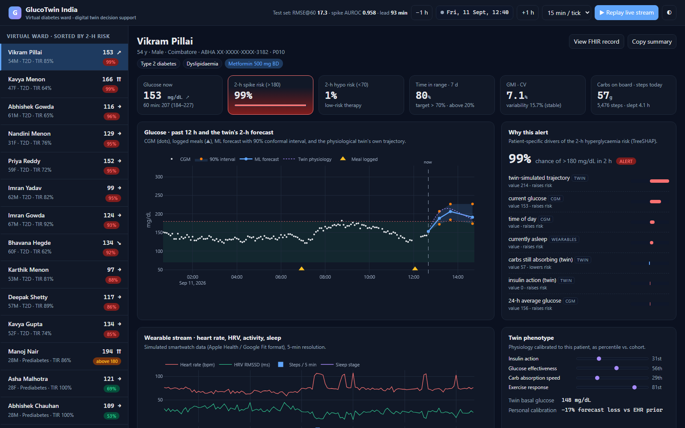
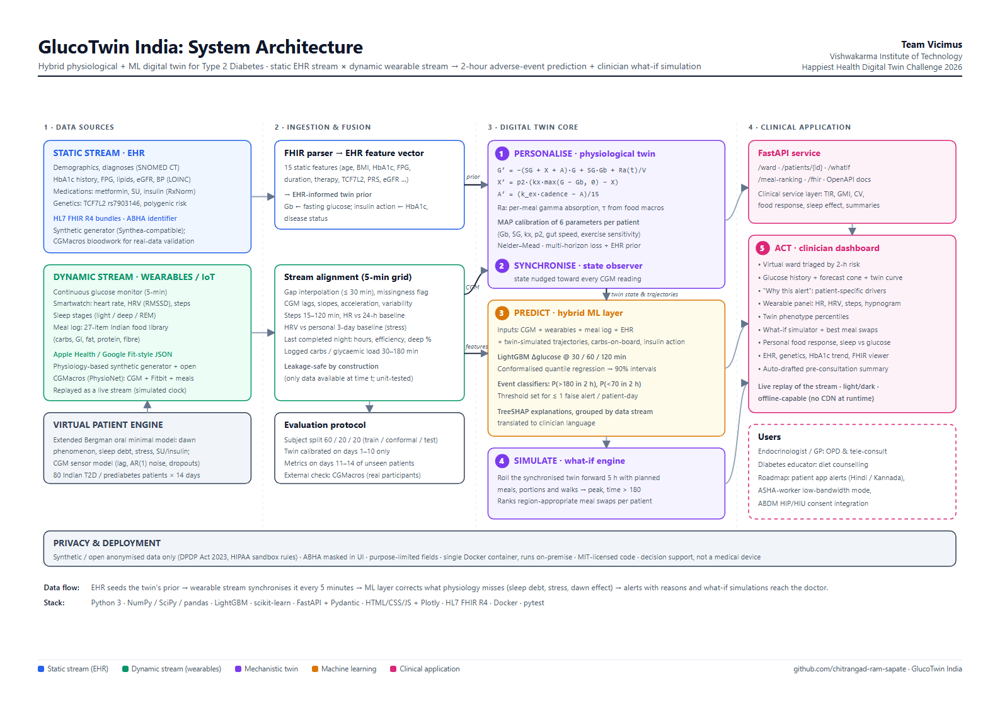

# GlucoTwin India

**A hybrid physiological + machine-learning digital twin that forecasts glucose excursions up to 2 hours ahead for people with Type 2 Diabetes, and lets a doctor test diet, activity and therapy changes on the patient's virtual replica before prescribing them.**

> Team **Vicimus**, Vishwakarma Institute of Technology. Submission for the **Happiest Health Digital Twin Challenge 2026**: *Reimagining and Reforming Healthcare in India Summit*, Bengaluru.



---

## 1. Team details

| | |
|---|---|
| **Team name** | **Vicimus** |
| **College** | **Vishwakarma Institute of Technology (VIT), Pune** |
| **Team leader** | Chitrangad Ram Sapate |
| **Team members** | Chitrangad Ram Sapate, Soham Joshi |

## 2. Project title

**GlucoTwin India: personalised digital twin for early warning and what-if simulation in Type 2 Diabetes**

## 3. Problem statement and healthcare use case

India has an estimated **101 million people with diabetes and 136 million with prediabetes** (ICMR-INDIAB, *Lancet Diabetes Endocrinol* 2023). Fewer than 1 in 3 reach glycaemic targets. Care is **reactive**: a patient meets a doctor every 3 months, HbA1c is checked, and the doctor sees a single average with no view of what happened on the 90 days in between.

Post-meal glucose excursions, which are common with India's carbohydrate-heavy rice and wheat diets, drive vascular damage and are invisible in HbA1c. Consumer wearables and affordable CGMs now produce the data needed to see these excursions, but **no doctor can read 20,000 data points per patient**.

**GlucoTwin** turns that stream into a *virtual patient* the doctor can interact with:

| Who | What GlucoTwin does |
|---|---|
| **Doctor (OPD / tele-consult)** | A virtual ward triaged by 2-hour risk. One screen per patient fuses EHR, CGM and smartwatch data, with explained alerts and an auto-drafted pre-consultation summary |
| **Doctor (treatment planning)** | A **what-if simulator**: *"If she swaps white rice for jowar roti and walks 15 minutes after lunch, what happens to her afternoon glucose?"* answered by the patient's own calibrated twin |
| **Patient / ASHA worker** | Early warning 30–120 minutes before a spike, while a walk or a smaller portion can still prevent it |

**Adverse event predicted:** a new hyperglycaemic excursion (> 180 mg/dL) within the next 2 hours. Secondary outputs: glucose trajectory at 30/60/120 min with calibrated uncertainty, and hypoglycaemia risk (< 70 mg/dL) for patients on sulfonylureas or insulin.

## 4. What makes this a *digital twin* (not just a predictor)



```
            STATIC STREAM (EHR, FHIR R4)              DYNAMIC STREAM (wearables, 5-min)
   demographics · diagnoses · HbA1c history ·    CGM · heart rate · HRV (RMSSD) · steps ·
   labs · medications · TCF7L2 · polygenic risk  sleep stages · meal log (Indian food library)
                    │                                          │
                    ▼                                          ▼
     ┌──────────── 1. PERSONALISE ───────────┐    ┌──── 2. SYNCHRONISE ────┐
     │ EHR-informed prior → MAP calibration   │    │ state observer pulls   │
     │ of 6 physiological parameters on the   │──▶ │ the twin toward every  │
     │ patient's own history (minimal model)  │    │ new CGM reading        │
     └────────────────────────────────────────┘    └───────────┬────────────┘
                                                                ▼
     ┌──────────── 3. PREDICT (hybrid) ──────────────────────────────────────┐
     │ LightGBM on fused features + twin-simulated trajectories               │
     │ → glucose @30/60/120 min with conformal 90% intervals                  │
     │ → P(spike > 180 in 2 h), P(hypo < 70 in 2 h) with TreeSHAP reasons     │
     └───────────────────────────────────────────────────────────────────────┘
     ┌──────────── 4. SIMULATE ─────────┐   ┌──────────── 5. ACT ─────────────┐
     │ what-if: meals, portions, walks  │   │ clinician dashboard, triage,    │
     │ rolled forward from *now*        │   │ explanations, visit summary     │
     └──────────────────────────────────┘   └─────────────────────────────────┘
```

1. **Personalised.** Each patient gets their own insulin action, glucose effectiveness, basal glucose, carbohydrate absorption speed and exercise sensitivity. The values are fitted to *their* data, starting from a prior derived from *their* EHR.
2. **Synchronised.** The twin's internal state (plasma glucose, remote insulin action, activity effect, carbs still in the gut) is updated with every CGM reading.
3. **Simulatable.** Because it is mechanistic, the twin answers counterfactual questions that a pure ML model cannot.
4. **Hybrid.** The physiology model is deliberately simple. An ML layer learns what physiology leaves out (sleep debt, stress, dawn phenomenon, medication timing) from the wearable and EHR data.

## 5. Technical stack and AI/ML details

| Layer | Technology |
|---|---|
| Synthetic data engine | NumPy / SciPy. Extended Bergman oral minimal model with dawn phenomenon, sleep-debt insulin resistance, stress hyperglycaemia, counter-regulation, sulfonylurea/insulin action; CGM sensor model (interstitial lag, AR(1) noise, dropouts) |
| EHR interoperability | **HL7 FHIR R4** bundles: Patient (ABHA identifier), Condition (SNOMED CT), Observation (LOINC), MedicationStatement (RxNorm), genetic variant observation |
| Twin model | Oral minimal model on a 5-min grid. MAP calibration (Nelder–Mead, EHR-informed log-normal prior). Luenberger-style state observer. Vectorised multi-start forecasting |
| Forecasting | LightGBM regressors on Δglucose at 30/60/120 min |
| Uncertainty | **Conformalised Quantile Regression** (Romano et al., 2019), calibrated on held-out patients |
| Event alerts | LightGBM classifiers. Alert threshold chosen for **≤ 1 false alert per patient-day** (alert fatigue is a safety issue) |
| Explainability | LightGBM-native **TreeSHAP**, grouped by data stream and translated to plain language |
| Backend | FastAPI (typed with Pydantic), stateless "replay clock" that simulates a live stream |
| Frontend | Dependency-free HTML/CSS/JS + Plotly (bundled for offline demos); light and dark themes; responsive |
| Quality | pytest (physiology, FHIR, twin calibration, *no-future-leakage* test, metrics); Docker |

### Indian context, built in
- **27-item Indian meal library** (idli, dosa, poha, aloo paratha, rice-dal, rajma chawal, biryani, jowar/ragi, chai-biscuits, samosa…) with carbohydrate, GI, fat, protein and fibre. These drive absorption speed in both the simulator and the twin.
- **Regional diets** (South: rice-dominant; North: wheat-dominant) and region-aware meal swap suggestions.
- **South Asian phenotype priors**: diabetes at lower BMI, higher insulin resistance, TCF7L2 risk-allele frequency of about 0.28.
- **ABDM-ready**: synthetic ABHA identifiers and FHIR R4 resources, as used by India's National Digital Health Mission.
- **DPDP Act 2023 by design**: synthetic data only, ABHA masked in the UI, purpose-limited fields, all computation runnable on-premise in one container.

## 6. Results

Evaluation protocol (no leakage): **subject-level split**, 48 train / 16 conformal-calibration / 16 test patients. Each twin is calibrated on days 1–10 only. All metrics are reported on **days 11–14 of unseen test patients**. Full auto-generated report: [`reports/RESULTS.md`](reports/RESULTS.md).

**Headline (unseen patients, unseen days):**

| Metric | Value |
|---|---|
| 60-min forecast RMSE / MARD | **17.3 mg/dL / 7.5%** (persistence: 37.5) |
| Clarke error grid A+B (60 min) | **99.7%** |
| 90% conformal interval coverage (60 min) | **88.8%** |
| 2-h spike alert AUROC / precision / recall | **0.958 / 0.86 / 0.67** |
| Excursions flagged in advance | **159/162 (98%)**, median lead **92 min** |
| False alerts | **1.17 per patient-day** (operating point set for ≤ 1 on calibration patients) |
| Twin parameter recovery (Spearman ρ) | insulin action **0.90**, basal glucose **0.87** |

**Ablation: every data stream adds value.** Fusing the wearable and meal stream with CGM cuts 30-min error by about 23%. Adding the twin's physiological simulation gives the best model at every horizon.

| Model | RMSE @30 min | RMSE @60 min | RMSE @120 min | 2-h spike AUROC |
|---|---|---|---|---|
| Persistence | 21.9 | 37.5 | 53.8 | - |
| Linear extrapolation | 23.0 | 50.3 | 94.3 | - |
| Twin only (physiology) | 17.6 | 24.2 | 37.5 | - |
| CGM only | 12.9 | 21.9 | 27.1 | 0.947 |
| + Wearables & meal log | 9.9 | 18.3 | 25.9 | 0.958 |
| + EHR (stream fusion) | 9.7 | 18.1 | 26.0 | 0.955 |
| **+ Twin physiology (full hybrid)** | **9.1** | **17.1** | **24.9** | **0.959** |


| Clarke error grid (60 min) | Twin parameter recovery |
|---|---|
|  |  |


### External validation on real people (CGMacros)

The same pipeline, with one data adapter, was run on **45 real adults** (15 healthy, 16 prediabetes, 14 T2D) from the open-access [CGMacros](https://physionet.org/content/cgmacros/1.0.0/) dataset: Dexcom/Libre CGM, Fitbit heart rate and activity, macro-annotated meals and fasting labs. Twins were calibrated on the first 60% of each recording. The ML layer was evaluated with **5-fold leave-subjects-out** cross-validation on the last 40%. Full report: [`reports/REAL_DATA_VALIDATION.md`](reports/REAL_DATA_VALIDATION.md).

| Model (real data) | RMSE @30 | RMSE @60 | RMSE @120 |
|---|---|---|---|
| Persistence | 20.0 | 29.1 | 38.6 |
| Twin only (physiology) | 28.1 | 32.1 | 32.7 |
| CGM only | 16.6 | 23.8 | 28.7 |
| + Wearable & meal log | 15.9 | 23.2 | 28.1 |
| + Labs/EHR (stream fusion) | 15.9 | 23.5 | 28.2 |
| **+ Twin physiology (full hybrid)** | 15.6 | 22.5 | 27.1 |

- On real data the full hybrid beats persistence by **22%** at 60 min and beats CGM-only at every horizon. Clarke A+B is **99.6%**.
- **281/298** real excursions above 180 mg/dL were flagged in advance (median lead **68 min**) at an uncalibrated threshold that produces 2.6 false alerts per day. Tuning this to the ≤ 1/day clinical operating point is the next step.
- Where it does **not** help yet: the twin alone is worse than persistence at 30 min (its value is at longer horizons and for simulation), and fasting labs add no measurable accuracy with n = 45.


> **Honest caveat.** The synthetic results are an upper bound, because we designed that physiology. The CGMacros results are the realistic estimate, but on a small, non-Indian cohort without sleep or HRV data. Neither is a clinical claim.

## 7. Run it

```bash
pip install -r requirements.txt
python -m glucotwin.pipeline           # generate cohort → calibrate 80 twins → train → evaluate (~3 min)
uvicorn glucotwin.api:app --port 8000  # open http://localhost:8000

# optional: external validation on real data (downloads ~7 MB of CGMacros CSVs from PhysioNet)
python scripts/fetch_cgmacros.py
python -m glucotwin.realdata

# optional: rebuild docs/architecture.pdf and docs/presentation.pdf (needs Chrome or Edge)
python scripts/build_docs.py
```

Or with Docker: `docker compose up --build`, then open http://localhost:8000.

Tests: `python -m pytest -q`

### Using the dashboard
1. The **virtual ward** (left) lists unseen test patients sorted by 2-hour risk.
2. Press **▶ Replay live stream** to watch the wearable stream arrive in simulated real time. Alerts, forecasts and the ward order update live.
3. **Why this alert** shows the patient-specific drivers (meal, sleep debt, HRV, trend, twin physiology).
4. **What-if simulator**: choose a meal, portion, timing and post-meal walk, then compare trajectories. **Best swaps** ranks region-appropriate alternatives for *this* patient.
5. **Pre-consultation summary**: auto-drafted narrative and discussion points to copy into the EMR.

### API
| Endpoint | Purpose |
|---|---|
| `GET /api/ward?at=` | triaged ward list |
| `GET /api/patients/{id}?at=` | full twin state: history, forecasts, risk + reasons, insights, summary |
| `POST /api/patients/{id}/whatif` | simulate scenarios (meals, portions, walks) from the current state |
| `GET /api/patients/{id}/meal-ranking?slot=` | personalised meal-swap ranking |
| `GET /api/patients/{id}/fhir` | the patient's FHIR R4 bundle |

Interactive docs: http://localhost:8000/docs

## 8. Repository structure

```
glucotwin/
  meals.py        Indian meal library (carbs, GI, macros → absorption kinetics)
  cohort.py       synthetic Indian T2D cohort: EHR, genetics, medications, FHIR R4 export
  lifestyle.py    sleep architecture, meals, activity, stress → HR / HRV / steps / sleep stages
  physiology.py   ground-truth virtual-patient physiology + CGM sensor model
  synth.py        cohort generator (writes data/synthetic)
  twin.py         the digital twin: model, EHR prior, calibration, observer, forecast, what-if
  features.py     static + dynamic + twin feature fusion (leakage-safe)
  models.py       LightGBM forecaster (CQR intervals) and event classifiers (TreeSHAP)
  metrics.py      RMSE/MARD, Clarke error grid, event-level lead time, alert-burden threshold
  pipeline.py     end-to-end training + evaluation + figures + report
  realdata.py     CGMacros adapter + leave-subjects-out real-data validation
  service.py      clinical service layer (ward, insights, summaries, simulation)
  api.py          FastAPI app
dashboard/        clinician UI (HTML/CSS/JS + Plotly)
scripts/          fetch_cgmacros.py (range-request CSV extraction), build_docs.py (PDF rendering)
tests/            pytest suite
reports/          RESULTS.md, REAL_DATA_VALIDATION.md, metrics, figures
docs/             architecture.pdf, presentation.pdf and their HTML sources
```

## 9. Data and the sandbox rules

All data is **synthetic** and generated by this repository (seed 2026), so no real patient data is used. This complies with the challenge sandbox rules, the DPDP Act 2023 and HIPAA. The generator's priors are anchored on published literature (ICMR-INDIAB; ADAG HbA1c–glucose relation; Bergman minimal model; IFCT 2017 / international GI tables).

**Validated on real data.** [CGMacros](https://physionet.org/content/cgmacros/1.0.0/) (PhysioNet, CC BY-NC-SA 4.0; Gutierrez-Osuna et al., 2025) is used for external validation. Its raw data is not redistributed here; `scripts/fetch_cgmacros.py` downloads it. Further open datasets on the roadmap:
- **Shanghai T1DM/T2DM CGM dataset** (Zhao et al., *Scientific Data* 2023): CGM + clinical + medication data
- **BIG IDEAs Lab Glycemic Variability** (PhysioNet): CGM + Empatica wearable
- **Synthea** for larger FHIR EHR cohorts

## 10. Roadmap

1. Validation on Indian CGM cohorts with partner diabetologists, and on the Shanghai T2DM dataset; calibrate the real-data alert threshold.
2. Particle-filter / Bayesian state estimation for twin uncertainty, and medication-titration simulation.
3. Patient-side app with Hindi and Kannada alerts, and an ASHA-worker low-bandwidth mode (SMS / WhatsApp).
4. ABDM sandbox integration (HIP/HIU consent flow) and a prospective pilot with a partner clinic.

## 11. Deliverables

| Item | Link |
|---|---|
| Video walkthrough (≥ 20 min) | _<unlisted YouTube link>_ |
| Architecture diagram (PDF) | [`docs/architecture.pdf`](docs/architecture.pdf) |
| Presentation (PDF) | [`docs/presentation.pdf`](docs/presentation.pdf) |

## 12. License

Code: **MIT** (see [LICENSE](LICENSE)). Synthetic data produced by the generator may be used freely. Meal composition values are approximations compiled from public tables, for research use only.

**Disclaimer:** GlucoTwin is a research proof of concept. It is not a medical device and must not be used for clinical decisions.
