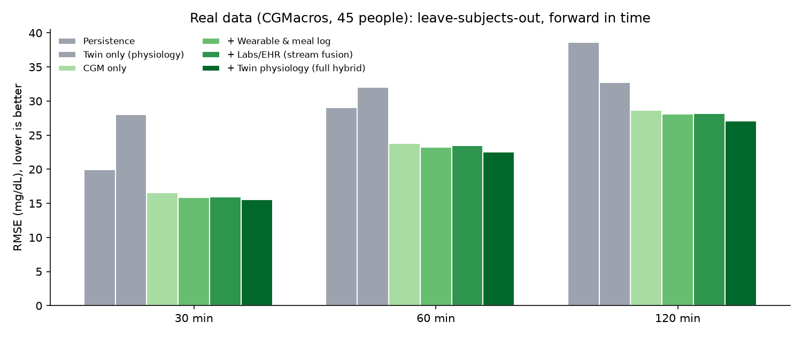

# External validation on real data: CGMacros

**45 real participants** (15 healthy, 16 prediabetes, 14 T2D by HbA1c) from the open-access CGMacros dataset (PhysioNet). Twins calibrated on the first 60% of each recording; ML evaluated with 5-fold **leave-subjects-out** CV on the last 40% (unseen people, future time).

| Model | RMSE @30 | RMSE @60 | RMSE @120 | AUROC rise >140 in 2 h | AUROC >180 in 2 h |
|---|---|---|---|---|---|
| Persistence | 20.0 | 29.1 | 38.6 | - | - |
| Twin only (physiology) | 28.1 | 32.1 | 32.7 | - | - |
| CGM only | 16.6 | 23.8 | 28.7 | 0.908 | 0.862 |
| + Wearable & meal log | 15.9 | 23.2 | 28.1 | 0.917 | 0.875 |
| + Labs/EHR (stream fusion) | 15.9 | 23.5 | 28.2 | 0.911 | 0.868 |
| + Twin physiology (full hybrid) | 15.6 | 22.5 | 27.1 | 0.909 | 0.869 |

- Full hybrid at 60 min: MARD 10.8%, Clarke A+B 99.6%.
- Personal twin calibration reduced the twin's forecast loss by 30% on average vs the lab-based prior.
- Excursions above 180 mg/dL in the evaluation window: 281/298 flagged in advance, median lead 68 min, 2.56 false alerts per participant-day at an uncalibrated 0.5 threshold.
- **Where the hybrid helps:** the full model beats CGM-only at every horizon, and wearable + meal data improve spike discrimination. **Where it does not (yet):** the twin alone is worse than persistence at 30 min (its value is at longer horizons and for simulation), and fasting labs add no measurable accuracy with n = 45.

Differences from the synthetic study: CGMacros has no HRV or sleep staging, activity comes from Fitbit METs rather than steps, meals carry macros but no GI (a default GI of 55 is used), and the cohort is American rather than Indian. The pipeline ran unchanged apart from this adapter.

Data: Gutierrez-Osuna R, Kerr D, Mortazavi B, Das A. *CGMacros: a scientific dataset for personalized nutrition and diet monitoring* (v1.0.0). PhysioNet, 2025. CC BY-NC-SA 4.0. Raw data is not redistributed in this repository; run `python scripts/fetch_cgmacros.py`.