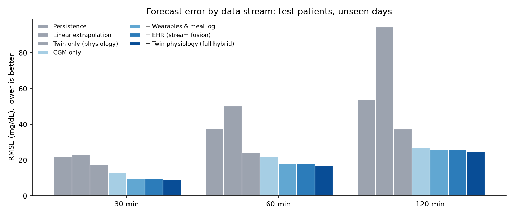
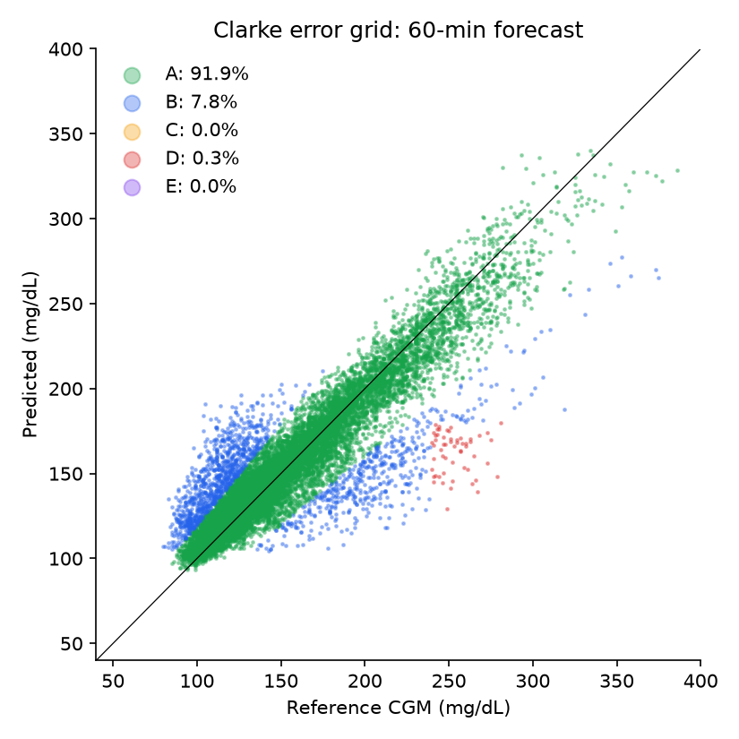
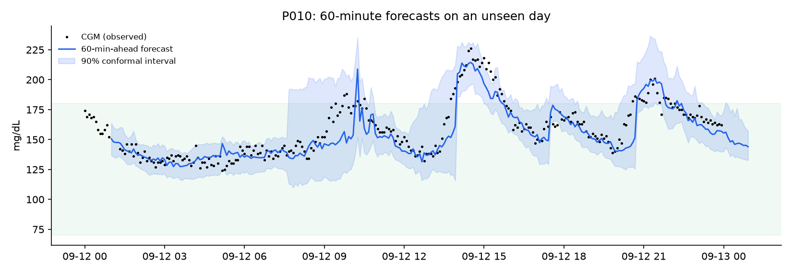
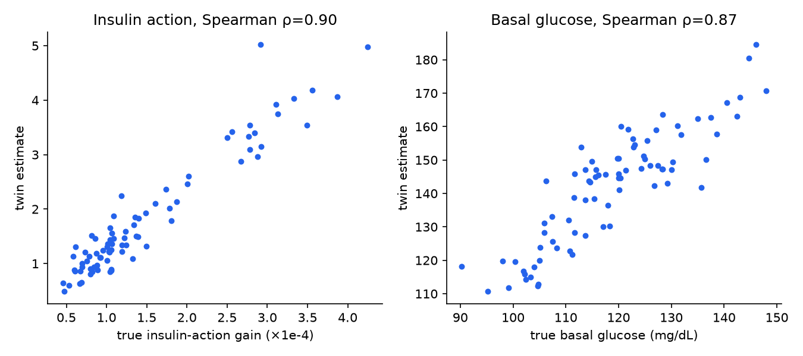
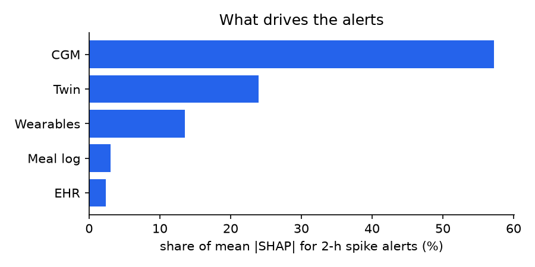

# GlucoTwin: evaluation results

_Auto-generated by `python -m glucotwin.pipeline`. Test set = unseen patients, unseen days._

## Forecast error and spike-alert discrimination

| Model | RMSE / Clarke A+B @30 min | @60 min | @120 min | 2-h spike AUROC |
|---|---|---|---|---|
| Persistence | 21.9 / 99.5% | 37.5 / 97.4% | 53.8 / 94.2% | n/a |
| Linear extrapolation | 23.0 / 100.0% | 50.3 / 95.2% | 94.3 / 80.4% | n/a |
| Twin only (physiology) | 17.6 / 99.6% | 24.2 / 99.1% | 37.5 / 95.9% | n/a |
| CGM only | 12.9 / 100.0% | 21.9 / 99.4% | 27.1 / 99.1% | 0.947 |
| + Wearables & meal log | 9.9 / 100.0% | 18.3 / 99.6% | 25.9 / 99.3% | 0.958 |
| + EHR (stream fusion) | 9.7 / 100.0% | 18.1 / 99.6% | 26.0 / 99.4% | 0.955 |
| + Twin physiology (full hybrid) | 9.1 / 100.0% | 17.1 / 99.6% | 24.9 / 99.3% | 0.959 |

## Final hybrid twin

| Horizon | RMSE | MAE | MARD | Clarke A | Clarke A+B | 90% interval coverage | mean width |
|---|---|---|---|---|---|---|---|
| 30 min | 9.1 | 6.6 | 4.5% | 99.1% | 100.0% | 90.0% | 27 mg/dL |
| 60 min | 17.3 | 11.1 | 7.5% | 91.9% | 99.7% | 88.8% | 43 mg/dL |
| 120 min | 25.1 | 16.2 | 10.6% | 85.1% | 99.4% | 88.1% | 62 mg/dL |

**2-hour hyperglycaemia alert:** AUROC 0.958, AUPRC 0.882, precision 0.86, recall 0.67 at threshold 0.72.

**Event level:** 159/162 excursions above 180 mg/dL flagged in advance (98%), median lead time **92 min**, 1.17 false alerts per patient-day.

## Twin fidelity (parameter recovery against hidden ground truth)

- Spearman ρ basal glucose: 0.87
- Spearman ρ insulin-action gain: 0.90
- Spearman ρ gut absorption speed: 0.77
- Personal calibration reduces twin forecast loss by 21% vs EHR-only prior

## Share of alert explanations by data stream

- CGM: 57%
- Twin: 24%
- Wearables: 14%
- Meal log: 3%
- EHR: 2%

